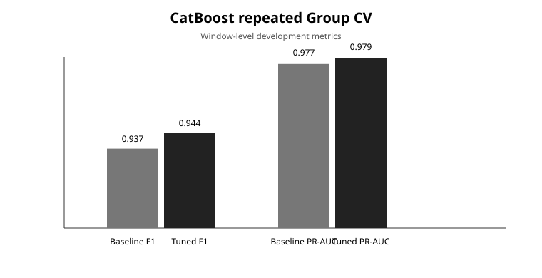
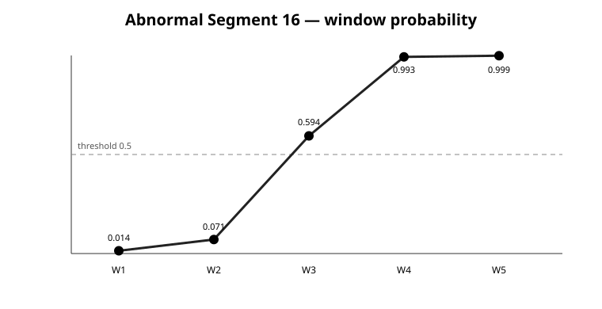

# Press Equipment Anomaly Detection

**프레스 유압펌프의 진동·전류 센서 데이터를 1초 단위 window로 변환하고, segment 누수를 방지한 group-aware validation으로 정상/이상 상태를 분류한 제조 AI 프로젝트입니다.**

## 1. Problem — 왜 이 문제를 풀었나

제조 설비의 이상을 조기에 선별할 수 있다면 비계획 정지와 점검 비용을 줄이는 데 도움이 됩니다. 이 프로젝트는 KAMP 공개 제조 센서 데이터의 `AI0_Vibration`, `AI1_Vibration`, `AI2_Current`를 이용해 **현재 센서 구간의 정상/이상 상태를 분류**하는 것을 목표로 합니다.

데이터셋 명칭에는 예지보전이 포함되어 있지만, 현재 제공된 label과 수집 구조만으로 고장까지 남은 시간(RUL)을 예측했다고 주장하기는 어렵습니다. 따라서 본 저장소에서는 문제를 **설비 상태 이상 탐지/분류**로 정의합니다.

## 2. Data

- 출처: [KAMP 소성가공 예지보전 AI 데이터셋](https://www.kamp-ai.kr/aidataDetail?AI_SEARCH=%EC%86%8C%EC%84%B1%EA%B0%80%EA%B3%B5&page=1&DATASET_SEQ=48&DISPLAY_MODE_SEL=CARD&EQUIP_SEL=&GUBUN_SEL=&FILE_TYPE_SEL=&WDATE_SEL=)
- 사용 파일: `press_data_normal.csv`, `outlier_data.csv`
- Raw rows: 정상 20,000 / 이상 600
- 센서: AI0 vibration, AI1 vibration, AI2 current
- 관찰된 sampling interval: 약 0.1초(10 Hz)
- 클래스 비율: 정상 약 97.1%, 이상 약 2.9%

원본 데이터는 저장소에 포함하지 않습니다. 배치 방법은 [`data/README.md`](data/README.md)를 참고하세요.

## 3. Approach

### 3.1 Time-aware segmentation
인접 `TimeStamp` 간격이 0.11초를 초과하면 새로운 측정 구간(`segment_id`)으로 정의했습니다. 동일 segment의 window가 train/test에 동시에 들어가지 않도록 group 단위로 분할했습니다.

### 3.2 Windowing & feature engineering
- 10 samples ≈ 1 second
- non-overlapping window
- segment 경계를 넘는 window 생성 금지
- 센서별 `mean`, `std`, `RMS`, `min`, `max` → 총 15개 feature
- `peak_to_peak = max - min`의 정확한 선형 종속성을 제거해 최종 feature에서 제외

### 3.3 Model selection
- Logistic Regression: 선형 baseline
- Random Forest: 비선형 tree baseline
- CatBoost: boosting 기반 최종 개발 후보

대규모 탐색 대신 제한적인 소규모 tuning만 수행했습니다. abnormal segment가 적어 validation 결과에 과도하게 맞추는 것을 피하기 위한 선택입니다.

### 3.4 Validation
`StratifiedGroupKFold`로 동일 segment가 train/test에 섞이지 않게 했으며, 10개 random state × 5-fold 반복 평가로 split 민감도를 확인했습니다.

## 4. Results

### Tuned CatBoost
설정: `depth=4`, `learning_rate=0.03`, `iterations=400`, `auto_class_weights='Balanced'`

| Evaluation | Precision | Recall | F1 | Balanced Accuracy | PR-AUC |
|---|---:|---:|---:|---:|---:|
| Window-level repeated Group CV | 0.976 | **0.915** | **0.944** | **0.957** | **0.979** |
| Segment-level mean aggregation | 1.000 | **0.994** | **0.997** | **0.997** | - |

Segment-level 값은 usable abnormal segment가 17개뿐이므로 독립 test 성능처럼 해석하지 않습니다. Baseline 대비 tuned model의 window F1은 `0.937 → 0.944`, PR-AUC는 `0.977 → 0.979`로 소폭 개선됐습니다.



상세 수치는 [`results/summary_metrics.csv`](results/summary_metrics.csv)를 참고하세요.

## 5. Error analysis

### Segment 16 — 구간 내부 상태 변화
5개의 1초 window에서 평균 이상확률이 약 `0.014 → 0.071 → 0.594 → 0.993 → 0.999`로 변했습니다. 구간 전체 평균만 사용할 경우 앞쪽 정상형 window가 후반 이상 신호를 희석할 수 있음을 확인했습니다.



### Segment 20 — rare / training-composition-sensitive pattern
진동은 상대적으로 낮지만 전류 level이 정상 분포와 크게 다른 사례였습니다. 반복 split에 따라 예측확률 변동이 커, 유사 abnormal pattern의 학습 포함 여부에 민감한 사례로 관찰했습니다.

## 6. Operational action plan

현재 모델이 정비 우선순위를 자동 확정한다고 가정하지 않습니다. 제안 workflow는 다음과 같습니다.

`센서 → 이상 탐지 → 표준 점검 템플릿 → 현장 판단 → 조치 → 결과 저장 → 향후 모델 고도화`

표준 템플릿에는 AI 이상정보뿐 아니라 설비 중요도, 안전 영향, 생산 영향, 정비이력, 현장 점검 결과를 함께 기록하는 구조를 제안합니다. 구체적인 가중치와 행동 threshold는 실제 현장 데이터와 전문가 합의가 확보된 이후 정의해야 합니다. 자세한 내용은 [`docs/action_plan.md`](docs/action_plan.md)를 참고하세요.

현장 활용방안 설계를 위해 국내외 제조/산업 사례 50개를 별도로 조사했습니다. 원본 조사자료는 [`docs/market_research.md`](docs/market_research.md)에 링크했습니다.

## 7. Limitations

- usable abnormal segment가 17개로 매우 적음
- 정상/이상 데이터가 별도 수집 세션이라면 session confounding 가능성
- 현재 label로 실제 고장 시작시점, 고장 유형, RUL을 확정할 수 없음
- aggregation 및 tuning 역시 개발 CV를 보면서 결정했으므로 완전 독립 test 성능은 아님
- 설비 중요도, 안전등급, 생산손실, 실제 정비결과가 없어 정비 action을 직접 학습할 수 없음

자세한 내용은 [`docs/validation_notes.md`](docs/validation_notes.md)를 참고하세요.

## 8. Repository structure

```text
press-equipment-anomaly-detection/
├── README.md
├── requirements.txt
├── .gitignore
├── data/
│   └── README.md
├── notebooks/
│   └── KMAP_analysis.ipynb
├── src/
│   ├── config.py
│   ├── data.py
│   ├── features.py
│   ├── evaluate.py
│   └── train.py
├── models/
│   └── README.md
├── results/
│   ├── summary_metrics.csv
│   └── figures/
└── docs/
    ├── validation_notes.md
    ├── market_research.md
    └── action_plan.md
```

## 9. Reproduce

원래 실험은 **가상환경의 Jupyter kernel `Python (KAMP 2026)` / Python 3.11.16**에서 수행했습니다.

```bash
python -m venv .venv
# Windows
.venv\Scripts\activate

pip install -r requirements.txt
python -m src.train --data-dir data --save-model
```

현재 `requirements.txt`는 notebook import를 기준으로 작성했습니다. 원래 가상환경의 정확한 package version까지 재현하려면 해당 환경에서 다음을 실행해 lock 파일을 추가해야 합니다.

```bash
pip freeze > requirements-lock.txt
```

## 10. Notebook

[`notebooks/KMAP_analysis.ipynb`](notebooks/KMAP_analysis.ipynb)은 원래 실험을 바탕으로 GitHub 재현용 흐름을 정리한 notebook입니다. 재사용 가능한 로직은 `src/`로 분리했습니다.

---

**Project status:** 분석/포트폴리오용 개발 버전입니다. 생산환경 배포 시스템이 아니며 실제 제조 현장 적용 전에는 독립 수집 세션 검증과 현장 전문가 검토가 필요합니다.
